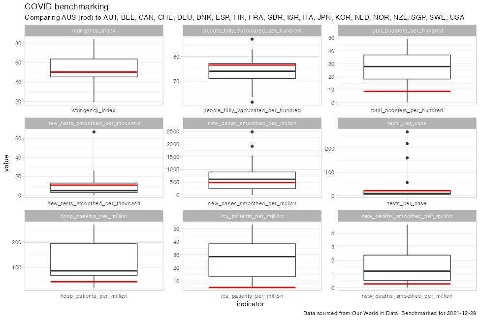

# COVID benchmarking

This repository contains R code that I have used to benchmark a country
against other countries.

The core code is in the `analysis.R` file. All code and the associated
runtime environment is encapsulated by `renv` and should be reproducible
from this.

The most recent benchmark is:

``` r
library(fs)
library(stringr)
most_recent_date <- fs::dir_ls("fig/") |>
  fs::path_file() |>
  str_extract("[[:digit:]]{4}-[[:digit:]]{2}-[[:digit:]]{2}") |> 
  as.Date() |>
  max()
fs::path("fig", paste0("bench_", most_recent_date), ext = "png") |>
  knitr::include_graphics()
```

<!-- -->
