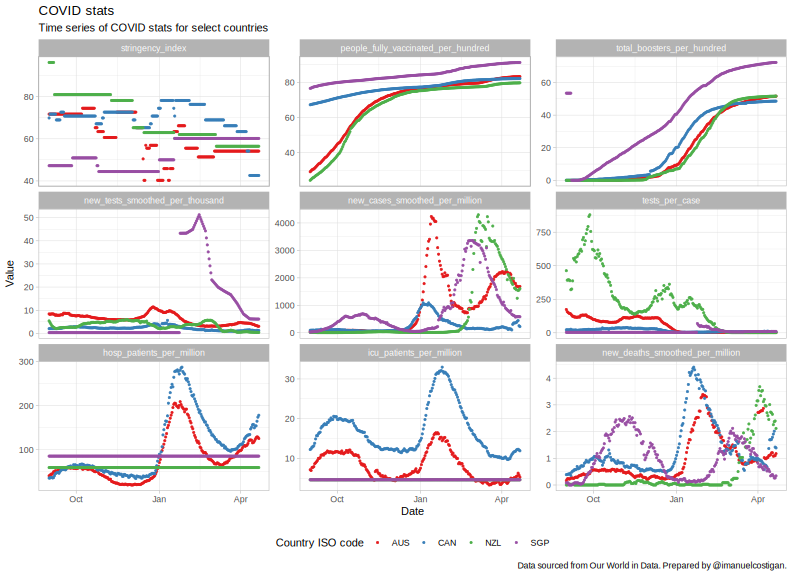
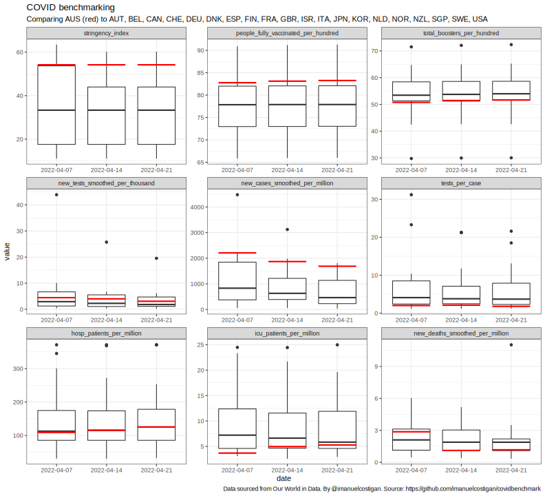

# COVID benchmarking

This repository contains R code that I have used to benchmark a country
against other countries.I have benchmarked Australia against a selection
of OECD countries.

## Setup

First let’s set up some global variables:

``` r
country_of_interest <- "AUS"
countries <- c(country_of_interest, "NZL", "USA", "GBR", "CAN", "DEU", "FRA", 
  "AUT", "BEL", "SGP", "DNK", "ISR", "ITA", "JPN", "KOR", "NLD", "FIN", "NOR", 
  "SWE", "ESP", "CHE")
countries <- countries[order(countries)]
smaller_set_of_countries <- c(country_of_interest, "CAN", "NZL", "SGP")
start_date <- as.Date("2021-09-01")
```

## Data sourcing

All data is sourced from [Our World in
Data](https://github.com/owid/covid-19-data/tree/master/public/data).

``` r
url <- "https://covid.ourworldindata.org/data/owid-covid-data.csv"
owid <- read_csv(url, show_col_types = FALSE)
```

## Data post-processing

Post-processing of this data set includes:

0.  Translating the “wide” format OWID data set into a “long” format.
1.  Filtering for countries that are of interest (in my case, a
    selection of OECD countries).
2.  Filling missing values with the last available value.

``` r
owid_long_tbl <-
  owid |>
  filter(
    iso_code %in% countries,
    date >= start_date
  ) |>
  select(
    iso_code,
    location,
    date,
    stringency_index,
    people_fully_vaccinated_per_hundred,
    total_boosters_per_hundred,
    new_tests_smoothed_per_thousand,
    new_cases_smoothed_per_million,
    # "Tests conducted per new confirmed case of COVID-19, given as a rolling
    #  7-day average (this is the inverse of positive_rate)"
    tests_per_case,
    hosp_patients_per_million, # stock, not flow.
    icu_patients_per_million,  # stock, not flow.
    new_deaths_smoothed_per_million
  ) |>
  fill(
    stringency_index,
    people_fully_vaccinated_per_hundred,
    total_boosters_per_hundred,
    new_tests_smoothed_per_thousand,
    new_cases_smoothed_per_million,
    tests_per_case,
    hosp_patients_per_million,
    icu_patients_per_million,
    new_deaths_smoothed_per_million
  ) |> 
  pivot_longer(
    cols = !c("iso_code", "location", "date"),
    names_to = "indicator",
    values_to = "value"
  ) |>
  mutate(
    indicator = as_factor(indicator)
  )
```

The following compares the country of interest to a selection of the
other countries since the `start_date` defined above.

``` r
owid_long_tbl |> 
  filter(iso_code %in% smaller_set_of_countries) |>
  ggplot(aes(x = date, y = value, colour = iso_code)) +
  geom_point(size = 0.75) +
  scale_colour_brewer(type = "qual", palette = "Set1") +
  facet_wrap(vars(indicator), scales = "free_y") +
  theme_light() +
  theme(legend.position = "bottom") +
  labs(
    title = "COVID stats", 
    subtitle = "Time series of COVID stats for select countries",
    x = "Date",
    y = "Value",
    colour = "Country ISO code",
    caption = paste("Data sourced from Our World in Data.", 
      "Prepared by @imanuelcostigan.")
  )
```

    ## Warning: Removed 36 rows containing missing values (geom_point).

<!-- -->

And finally, we compare the country of interest to the other countries.
We do this on the most recent date for which we have data for all
countries of interest.

``` r
benchmark_date <- owid_long_tbl |> 
  group_by(iso_code) |> 
  summarise(last_date = max(date, na.rm = TRUE)) |> 
  pull(last_date) |> 
  min()
last_benchmark_dates <- benchmark_date - c(14, 7)
owid_snaps <-
  owid_long_tbl |>
  filter(date %in% c(last_benchmark_dates, benchmark_date)) |> 
  mutate(date = as.character(date))
owid_country_of_interest <- 
  owid_snaps |>
  filter(iso_code == country_of_interest)
owid_snaps |>
  ggplot(aes(x = date, y = value)) + 
  geom_boxplot()  +
  geom_boxplot(data = owid_country_of_interest, colour = "red") +
  facet_wrap(vars(indicator), scales = "free") +
  theme_bw() +
  labs(
    title = "COVID benchmarking",
    subtitle = paste0("Comparing ", country_of_interest, " (red) to ",
      paste0(countries[countries != country_of_interest], collapse = ", ")),
    caption = paste("Data sourced from Our World in Data.", 
      "By @imanuelcostigan. Source:", 
      "https://github.com/imanuelcostigan/covidbenchmark")
  )
```

<!-- -->
